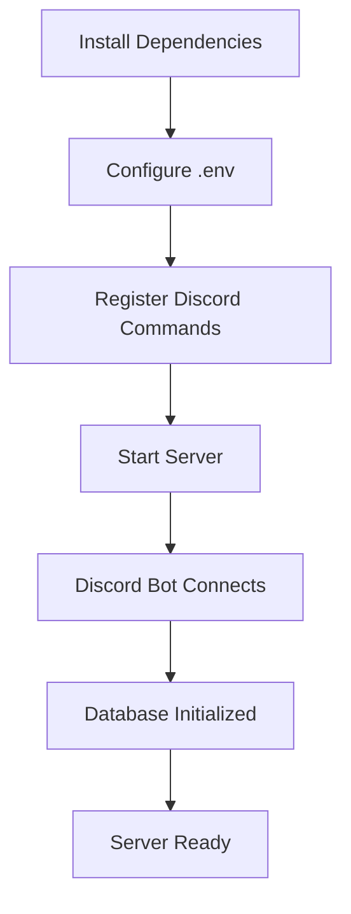

# 🔄 CheapForce Cloud - Complete Process Flow

A comprehensive visual guide to how CheapForce Cloud works from start to finish.

---

## 📋 Table of Contents

- [Initial Setup](#-initial-setup)
- [User Authentication](#-user-authentication)
- [First-Time Sync](#-first-time-sync)
- [Ongoing Auto-Sync](#-ongoing-auto-sync)
- [Discord Commands](#-discord-commands)
- [Storage Management](#-storage-management)
- [Backup & Restore](#-backup--restore)
- [Plan Management](#-plan-management)

---

## 🚀 Initial Setup

### Server Setup Flow



**Steps:**

1. **Install Dependencies**
   ```bash
   cd server
   npm install
   ```

2. **Configure Environment**
   ```env
   DISCORD_BOT_TOKEN=your_bot_token
   DISCORD_CLIENT_ID=your_app_id
   DISCORD_CHANNEL_ID=your_channel_id
   DISCORD_ADMIN_ID=your_user_id

   R2_ENDPOINT=https://account.r2.cloudflarestorage.com
   R2_ACCESS_KEY_ID=your_access_key
   R2_SECRET_ACCESS_KEY=your_secret_key
   R2_BUCKET_NAME=cheapforce-saves
   ```

3. **Register Commands**
   ```bash
   npm run register-commands
   ```
   ✅ Registers: `/link`, `/sync`, `/pull`, `/storage`, `/backup`, `/setplan`

4. **Start Server**
   ```bash
   npm run dev
   ```
   ✅ Server running on port 3000
   ✅ Discord bot connected
   ✅ Database created

---

### Client Setup Flow

```
┌─────────────────────┐
│ Install Dependencies│
└──────────┬──────────┘
           │
           ▼
┌─────────────────────┐
│  Configure .env     │
│  SERVER_URL         │
└──────────┬──────────┘
           │
           ▼
┌─────────────────────┐
│   Start Client      │
│   npm run dev       │
└──────────┬──────────┘
           │
           ▼
┌─────────────────────┐
│ Custom Folder Created│
│ ~/CheapForceCloud/  │
│    CustomFiles/     │
└──────────┬──────────┘
           │
           ▼
┌─────────────────────┐
│  Ready for Auth     │
└─────────────────────┘
```

**Steps:**

1. Install dependencies: `npm install`
2. Copy `.env.example` to `.env`
3. Set `SERVER_URL=http://localhost:3000`
4. Run `npm run dev`
5. Custom files folder auto-created
6. Client waits for authentication

---

## 🔐 User Authentication

### Complete Authentication Flow

```
┌──────────┐                 ┌──────────┐                 ┌──────────┐
│  User    │                 │ Discord  │                 │  Server  │
│          │                 │   Bot    │                 │          │
└─────┬────┘                 └────┬─────┘                 └────┬─────┘
      │                           │                            │
      │  1. Type /link            │                            │
      ├──────────────────────────►│                            │
      │                           │                            │
      │                           │  2. Generate 6-digit code  │
      │                           ├───────────────────────────►│
      │                           │                            │
      │                           │  3. Store in DB            │
      │                           │  (expires in 15 min)       │
      │                           │◄───────────────────────────┤
      │                           │                            │
      │  4. Send code via DM      │                            │
      │◄──────────────────────────┤                            │
      │                           │                            │
┌─────┴────┐                      │                            │
│  Client  │                      │                            │
└─────┬────┘                      │                            │
      │                           │                            │
      │  5. Enter code            │                            │
      ├────────────────────────────────────────────────────────►│
      │                           │                            │
      │                           │  6. Verify code            │
      │                           │  Create session            │
      │◄────────────────────────────────────────────────────────┤
      │                           │                            │
      │  7. Session token saved   │                            │
      │  ~/.cheapforce-cloud/     │                            │
      │  session.json             │                            │
      └───────────────────────────┴────────────────────────────┘
```

**Detailed Steps:**

1. **User initiates in Discord**
   ```
   User: /link
   ```

2. **Bot generates code**
   - Creates random 6-digit number
   - Stores in database with Discord ID
   - Sets expiration (15 minutes)

3. **Code sent to user**
   ```
   ╔════════════════════════════════════╗
   ║ CheapForce Cloud - Link Account   ║
   ╠════════════════════════════════════╣
   ║ Linking Code: 123456               ║
   ║ Expires In: 15 minutes             ║
   ╚════════════════════════════════════╝
   ```

4. **User enters code in client**
   ```
   Enter your 6-digit linking code: 123456
   ```

5. **Server validates**
   - Checks code exists
   - Verifies not expired
   - Marks code as used
   - Creates user if new
   - Generates session token

6. **Client receives session**
   ```json
   {
     "sessionId": "abc123...",
     "user": {
       "id": 1,
       "username": "UserName"
     }
   }
   ```

7. **Session saved locally**
   - File: `~/.cheapforce-cloud/session.json`
   - Persists across restarts
   - Used for all API calls

**Result:** ✅ User authenticated and ready to sync

---

## 🎮 First-Time Sync

### Initial Sync Process

```
┌──────────────────────────────────────────────────────────┐
│                   CLIENT STARTUP                          │
└───────────────────────┬──────────────────────────────────┘
                        │
            ┌───────────▼──────────┐
            │ Load Configurations  │
            │ - games-config.json  │
            │ - apps-config.json   │
            └───────────┬──────────┘
                        │
            ┌───────────▼──────────┐
            │  Detect User Plan    │
            │  (from server)       │
            └───────────┬──────────┘
                        │
         ┌──────────────┴──────────────┐
         │                             │
    ┌────▼─────┐                ┌─────▼────┐
    │   FREE   │                │ PLUS/    │
    │  Plan    │                │ PREMIUM  │
    └────┬─────┘                └─────┬────┘
         │                             │
    ┌────▼─────┐                ┌─────▼────┐
    │  Games   │                │  Games   │
    │  Only    │                │  + Apps  │
    └────┬─────┘                │  + Custom│
         │                      └─────┬────┘
         │                            │
         └──────────┬──────────────── ┘
                    │
        ┌───────────▼──────────┐
        │  Scan for Installed  │
        │  Games/Apps          │
        └───────────┬──────────┘
                    │
        ┌───────────▼──────────┐
        │ Show Detected Items  │
        │                      │
        │ ✓ Minecraft          │
        │ ✓ Terraria           │
        │ ✓ VS Code (Plus+)    │
        └───────────┬──────────┘
                    │
        ┌───────────▼──────────┐
        │ User Confirms Start  │
        └───────────┬──────────┘
                    │
        ┌───────────▼──────────┐
        │ Start File Watchers  │
        │ for each item        │
        └───────────┬──────────┘
                    │
        ┌───────────▼──────────┐
        │  Collect All Files   │
        │  in watched folders  │
        └───────────┬──────────┘
                    │
        ┌───────────▼──────────┐
        │   Initial Upload     │
        │   to R2 Storage      │
        └───────────┬──────────┘
                    │
        ┌───────────▼──────────┐
        │ ✅ Sync Complete     │
        │ Monitoring started   │
        └──────────────────────┘
```

**Console Output:**

```
╔════════════════════════════════════════╗
║   CheapForce Cloud - Save Manager    ║
╚════════════════════════════════════════╝

Welcome back, YourUsername!

Detected games:
  - Minecraft (/Users/you/Library/Application Support/minecraft/saves)
  - Terraria (/Users/you/Library/Application Support/Terraria)

Start monitoring 2 game(s)? (Y/n) y

Starting auto-sync...

Watching Minecraft:
  - /Users/you/Library/Application Support/minecraft/saves

Watching Terraria:
  - /Users/you/Library/Application Support/Terraria

Initial sync for minecraft: 15 file(s)

Syncing minecraft...
Uploading 15 file(s)
Successfully synced minecraft

✓ Auto-sync is running!
Saves sync every 5 minutes when changes are detected.
Use Discord commands /sync or /pull for manual control.
📡 Listening for Discord commands...
```

---

## ⚡ Ongoing Auto-Sync

### 5-Minute Batched Sync Flow

```
┌─────────────────────────────────────────────────────────────┐
│                    CONTINUOUS MONITORING                     │
└────────────────────────┬────────────────────────────────────┘
                         │
                         ▼
              ┌──────────────────────┐
              │  Chokidar Watches    │
              │  All Configured      │
              │  Directories         │
              └──────────┬───────────┘
                         │
                         │ File Change Detected
                         ▼
              ┌──────────────────────┐
              │  Mark as Pending     │
              │  Save file path      │
              │  in memory           │
              └──────────┬───────────┘
                         │
              ┌──────────▼───────────┐
              │  Console Output:     │
              │  File changed        │
              │  (pending sync):     │
              │  world.dat           │
              └──────────┬───────────┘
                         │
              ┌──────────▼───────────┐
              │  Wait for 5-minute   │
              │  interval timer      │
              └──────────┬───────────┘
                         │
                         │ Timer Triggers
                         ▼
              ┌──────────────────────┐
         ┌────┤  Pending Changes?    │
         │    └──────────┬───────────┘
         │               │
    NO   │               │ YES
         │               ▼
         │    ┌──────────────────────┐
         │    │  Console Output:     │
         │    │  ⏰ Scheduled sync   │
         │    │  triggered for       │
         │    │  minecraft           │
         │    │  (3 changes)         │
         │    └──────────┬───────────┘
         │               │
         │               ▼
         │    ┌──────────────────────┐
         │    │  Collect ALL Files   │
         │    │  in watched folder   │
         │    └──────────┬───────────┘
         │               │
         │               ▼
         │    ┌──────────────────────┐
         │    │  Upload to R2        │
         │    │  Storage             │
         │    └──────────┬───────────┘
         │               │
         │               ▼
         │    ┌──────────────────────┐
         │    │  Update Database     │
         │    │  - storage_used      │
         │    │  - last_sync         │
         │    └──────────┬───────────┘
         │               │
         │               ▼
         │    ┌──────────────────────┐
         │    │  Clear Pending       │
         │    │  Changes             │
         │    └──────────┬───────────┘
         │               │
         └───────────────┴───────────┐
                         │
                         ▼
              ┌──────────────────────┐
              │  Wait for Next       │
              │  Interval (5 min)    │
              └──────────────────────┘
                         │
                         └──────┐
                                │
                      (Loop Forever)
```

**Timeline Example:**

```
00:00:00 - User plays Minecraft, saves game
00:00:01 - [File changed (pending sync): level.dat]

00:02:30 - User makes another save
00:02:31 - [File changed (pending sync): level.dat]

00:04:15 - User exits game
00:04:16 - [File changed (pending sync): session.lock]

00:05:00 - [⏰ Scheduled sync triggered for minecraft (3 changes detected)]
00:05:01 - [Syncing minecraft...]
00:05:02 - [Uploading 15 file(s)]
00:05:05 - [Successfully synced minecraft]

00:10:00 - (No changes - no sync)
00:15:00 - (No changes - no sync)
...
```

**Storage Structure After Sync:**

```
R2 Bucket: cheapforce-cloud-saves
│
└── users/
    └── 1/
        └── games/
            └── minecraft/
                ├── level.dat
                ├── level.dat_old
                ├── session.lock
                ├── advancements/
                │   └── user.json
                └── stats/
                    └── user.json
```

---

## 🎛️ Discord Commands

### Command: `/sync` (Force Sync)

```
┌──────────┐          ┌──────────┐          ┌──────────┐          ┌──────────┐
│  User    │          │ Discord  │          │  Server  │          │  Client  │
└────┬─────┘          └────┬─────┘          └────┬─────┘          └────┬─────┘
     │                     │                     │                     │
     │  1. /sync           │                     │                     │
     ├────────────────────►│                     │                     │
     │                     │                     │                     │
     │                     │  2. Verify User     │                     │
     │                     ├────────────────────►│                     │
     │                     │                     │                     │
     │                     │  3. Create Request  │                     │
     │                     │  (type: 'sync')     │                     │
     │                     │◄────────────────────┤                     │
     │                     │                     │                     │
     │  4. Confirmation    │                     │                     │
     │◄────────────────────┤                     │                     │
     │  "Sync request sent"│                     │                     │
     │                     │                     │                     │
     │                     │  5. Notification    │                     │
     │                     │  posted in channel  │                     │
     │◄────────────────────┤                     │                     │
     │                     │                     │                     │
     │                     │                     │  6. Poll (every 10s)│
     │                     │                     │◄────────────────────┤
     │                     │                     │                     │
     │                     │                     │  7. Return Request  │
     │                     │                     ├────────────────────►│
     │                     │                     │                     │
     │                     │                     │  8. Execute Sync    │
     │                     │                     │  forceSyncAll()     │
     │                     │                     │                     │
     │                     │                     │  9. Upload Files    │
     │                     │                     │────────────┐        │
     │                     │                     │            │        │
     │                     │                     │◄───────────┘        │
     │                     │                     │                     │
     │                     │                     │ 10. Mark Complete   │
     │                     │                     │◄────────────────────┤
     │                     │                     │                     │
     └─────────────────────┴─────────────────────┴─────────────────────┘
```

**Console Output:**

```
📡 Listening for Discord commands...

🔔 Discord command received: /sync

🔄 Force sync triggered for ALL games

Syncing minecraft...
Uploading 15 file(s)
Successfully synced minecraft

Syncing terraria...
Uploading 8 file(s)
Successfully synced terraria

✅ Force sync completed
```

---

### Command: `/pull` (Force Pull)

```
User → Discord: /pull
       │
       ▼
Discord → Server: Create pull request
       │
       ▼
Client (polling): Detect request
       │
       ▼
Client: Download saves for each game
       │
       ├─► Download minecraft saves as ZIP
       ├─► Extract to local folder
       ├─► Overwrite existing files
       │
       ├─► Download terraria saves as ZIP
       ├─► Extract to local folder
       └─► Overwrite existing files
       │
       ▼
Client → Server: Mark complete
       │
       ▼
✅ All saves restored
```

**Console Output:**

```
🔔 Discord command received: /pull

Downloading latest saves...
  ✓ minecraft restored
  ✓ terraria restored

✅ Force pull completed
```

---

### Command: `/storage` (View Usage)

```
┌──────────┐          ┌──────────┐          ┌──────────┐
│  User    │          │ Discord  │          │  Server  │
└────┬─────┘          └────┬─────┘          └────┬─────┘
     │                     │                     │
     │  1. /storage        │                     │
     ├────────────────────►│                     │
     │                     │                     │
     │                     │  2. Verify User     │
     │                     ├────────────────────►│
     │                     │                     │
     │                     │  3. Calculate       │
     │                     │  Storage Used       │
     │                     │  - List R2 files    │
     │                     │  - Sum sizes        │
     │                     │  - Update DB        │
     │                     │                     │
     │                     │  4. Get Plan Info   │
     │                     │  - Storage limit    │
     │                     │  - Features         │
     │                     │                     │
     │                     │  5. Generate        │
     │                     │  Progress Bar       │
     │                     │                     │
     │                     │  6. Return Embed    │
     │                     │◄────────────────────┤
     │                     │                     │
     │  7. Display Result  │                     │
     │◄────────────────────┤                     │
     └─────────────────────┴─────────────────────┘
```

**Discord Output:**

```
╔══════════════════════════════════════╗
║ 📊 CheapStorage+ - Storage Usage     ║
╠══════════════════════════════════════╣
║                                      ║
║   █████████████░░░░░░░░░░░░          ║
║                                      ║
║   Used         Total      Available  ║
║   2.5 GB       10 GB      7.5 GB    ║
║                                      ║
║   Percentage                         ║
║   🟢 25.00%                          ║
║                                      ║
╠══════════════════════════════════════╣
║ User ID: 1                           ║
║ Timestamp: 2025-10-25 02:30:45 UTC  ║
╚══════════════════════════════════════╝
```

**Under the Hood:**

```typescript
// 1. List all user files from R2
const files = await R2Storage.listFilesWithMetadata(userId);
// Returns: [
//   { key: 'users/1/games/minecraft/level.dat', size: 1024000 },
//   { key: 'users/1/games/terraria/world.wld', size: 2048000 },
//   ...
// ]

// 2. Calculate total
const totalBytes = files.reduce((sum, f) => sum + f.size, 0);
// Result: 2621440000 bytes (2.5 GB)

// 3. Update database
userOps.updateStorageUsed.run(totalBytes, userId);

// 4. Get plan info
const limit = PLAN_LIMITS[user.plan].storage; // 10GB
const percentUsed = (totalBytes / limit) * 100; // 25%

// 5. Generate progress bar
const bar = generateProgressBar(25, 25);
// Result: "█████████████░░░░░░░░░░░░"

// 6. Format for display
const used = formatBytes(2621440000);    // "2.5 GB"
const total = formatBytes(10737418240);  // "10 GB"
const avail = formatBytes(8115978240);   // "7.5 GB"
```

---

### Command: `/backup` (Download Backup)

```
┌────────────────────────────────────────────────────────────┐
│                   BACKUP GENERATION FLOW                    │
└──────────────────────┬─────────────────────────────────────┘
                       │
           ┌───────────▼──────────┐
           │  User Types /backup  │
           └───────────┬──────────┘
                       │
           ┌───────────▼──────────┐
           │  Show "Creating..."  │
           │  Please wait message │
           └───────────┬──────────┘
                       │
           ┌───────────▼──────────┐
           │  List All User Files │
           │  from R2 Storage     │
           └───────────┬──────────┘
                       │
                       ├──► games/minecraft/level.dat
                       ├──► games/terraria/world.wld
                       ├──► apps/vscode/settings.json
                       └──► custom/photo.jpg
                       │
           ┌───────────▼──────────┐
           │  Download Each File  │
           │  from R2             │
           └───────────┬──────────┘
                       │
           ┌───────────▼──────────┐
           │  Create ZIP Archive  │
           │  in Memory           │
           │                      │
           │  Structure:          │
           │  ├── games/          │
           │  ├── apps/           │
           │  └── custom/         │
           └───────────┬──────────┘
                       │
           ┌───────────▼──────────┐
           │  Check File Size     │
           └───────────┬──────────┘
                       │
         ┌─────────────┴─────────────┐
         │                           │
    ┌────▼─────┐              ┌─────▼────┐
    │ < 25 MB  │              │ > 25 MB  │
    └────┬─────┘              └─────┬────┘
         │                           │
    ┌────▼─────┐              ┌─────▼────┐
    │  Send as │              │ Upload   │
    │  Discord │              │ to R2    │
    │  Attach  │              │          │
    └────┬─────┘              └─────┬────┘
         │                           │
         │                      ┌────▼────┐
         │                      │ Generate│
         │                      │ Presign │
         │                      │ URL     │
         │                      │ (1 hour)│
         │                      └────┬────┘
         │                           │
         └──────────┬────────────────┘
                    │
        ┌───────────▼──────────┐
        │  Send to User        │
        │  via Discord         │
        └──────────────────────┘
```

**Small Backup (< 25MB):**

```
User: /backup

Bot: ⏳ Creating your backup archive... This may take a moment.

Bot: ✅ Your backup is ready! (12.5 MB)
     📎 cheapforce-backup-username-1698765432.zip
```

**Large Backup (> 25MB):**

```
User: /backup

Bot: ⏳ Creating your backup archive... This may take a moment.

Bot: ✅ Your backup is ready!

     ⚠️ File is too large for Discord (45.8 MB)

     🔗 Download link (valid for 1 hour):
     https://account.r2.cloudflarestorage.com/cheapforce-saves/
     users/1/custom/backup-1698765432.zip?X-Amz-Algorithm=...
```

---

## 📊 Storage Management

### Storage Quota Check Flow

```
┌────────────────────────────────────────────────────────────┐
│                    BEFORE EVERY UPLOAD                      │
└──────────────────────┬─────────────────────────────────────┘
                       │
           ┌───────────▼──────────┐
           │  Get User from DB    │
           │  - current plan      │
           │  - storage_used      │
           └───────────┬──────────┘
                       │
           ┌───────────▼──────────┐
           │  Calculate New Size  │
           │  current + upload    │
           └───────────┬──────────┘
                       │
           ┌───────────▼──────────┐
           │  Get Plan Limit      │
           └───────────┬──────────┘
                       │
         ┌─────────────┴─────────────┐
         │                           │
    ┌────▼─────┐              ┌─────▼────┐
    │ Within   │              │  Over    │
    │ Quota    │              │  Quota   │
    └────┬─────┘              └─────┬────┘
         │                           │
    ┌────▼─────┐              ┌─────▼────┐
    │  Allow   │              │  Reject  │
    │  Upload  │              │  Upload  │
    └────┬─────┘              └─────┬────┘
         │                           │
    ┌────▼─────┐              ┌─────▼────┐
    │ Upload   │              │  Return  │
    │ to R2    │              │  Error   │
    └────┬─────┘              │  402     │
         │                    └─────┬────┘
    ┌────▼─────┐                    │
    │ Update   │                    │
    │ storage_ │                    │
    │ used     │                    │
    └────┬─────┘                    │
         │                           │
         └──────────┬────────────────┘
                    │
        ┌───────────▼──────────┐
        │   Return Result      │
        └──────────────────────┘
```

**Example Scenarios:**

**Scenario 1: Upload Allowed**
```
User Plan: Plus (10 GB limit)
Current Usage: 8.5 GB
Upload Size: 1.2 GB
New Total: 9.7 GB ✅ ALLOWED

✓ Uploading 15 file(s)
✓ Successfully synced minecraft
Storage: 9.7 GB / 10 GB (97%)
```

**Scenario 2: Upload Rejected**
```
User Plan: Free (1 GB limit)
Current Usage: 950 MB
Upload Size: 100 MB
New Total: 1.05 GB ❌ REJECTED

❌ Upload failed: Storage quota exceeded
   Used: 950 MB
   Limit: 1 GB
   Attempted: +100 MB

Please:
1. Use /storage to check usage
2. Delete old backups
3. Upgrade plan with /setplan (admin)
```

---

## 🔄 Plan Management

### Admin Plan Change Flow

```
┌──────────┐          ┌──────────┐          ┌──────────┐          ┌──────────┐
│  Admin   │          │ Discord  │          │  Server  │          │  Client  │
└────┬─────┘          └────┬─────┘          └────┬─────┘          └────┬─────┘
     │                     │                     │                     │
     │  /setplan @User     │                     │                     │
     │  premium            │                     │                     │
     ├────────────────────►│                     │                     │
     │                     │                     │                     │
     │                     │  Verify Admin       │                     │
     │                     ├────────────────────►│                     │
     │                     │                     │                     │
     │                     │  Check User Exists  │                     │
     │                     │◄────────────────────┤                     │
     │                     │                     │                     │
     │                     │  Update DB:         │                     │
     │                     │  plan = 'premium'   │                     │
     │                     │◄────────────────────┤                     │
     │                     │                     │                     │
     │  Confirmation (DM)  │                     │                     │
     │◄────────────────────┤                     │                     │
     │  "Updated to        │                     │                     │
     │   PREMIUM"          │                     │                     │
     │                     │                     │                     │
     │  Notification       │                     │                     │
     │  (public channel)   │                     │                     │
     │◄────────────────────┤                     │                     │
     │  "@User upgraded    │                     │                     │
     │   to CheapStorage++"│                     │                     │
     │                     │                     │                     │
     │                     │                     │  Next /verify API   │
     │                     │                     │  call detects plan  │
     │                     │                     │◄────────────────────┤
     │                     │                     │                     │
     │                     │                     │  Return new plan    │
     │                     │                     ├────────────────────►│
     │                     │                     │                     │
     │                     │                     │  Client detects:    │
     │                     │                     │  - Premium features │
     │                     │                     │  - Custom folder    │
     │                     │                     │  - 100GB quota      │
     │                     │                     │                     │
     └─────────────────────┴─────────────────────┴─────────────────────┘
```

**What Changes Immediately:**

```
Database:
┌─────────────────────────────┐
│ users table                 │
├─────────────────────────────┤
│ id: 1                       │
│ plan: 'free' → 'premium'   │ ✅ Updated
│ storage_used: 512000000     │
└─────────────────────────────┘

Feature Access:
┌─────────────────────────────┐
│ Before (Free):              │
│ ✅ Games                    │
│ ❌ Apps                     │
│ ❌ Custom Files             │
└─────────────────────────────┘
              ↓
┌─────────────────────────────┐
│ After (Premium):            │
│ ✅ Games                    │
│ ✅ Apps                     │ ✅ Unlocked
│ ✅ Custom Files             │ ✅ Unlocked
└─────────────────────────────┘

Storage Quota:
1 GB → 100 GB ✅ Updated
```

**Client-Side Effects:**

```
Next client startup or sync:

1. Client calls /api/auth/verify
2. Server returns updated user object:
   {
     "plan": "premium",
     "storage_used": 512000000
   }

3. Client detects premium plan:
   ✓ Loads apps-config.json
   ✓ Creates CustomFiles folder (if not exists)
   ✓ Starts watching custom folder
   ✓ Updates UI/console messages

Console Output:
📦 Plan upgraded to Premium!
   ✓ Apps backup enabled
   ✓ Custom files enabled
   ✓ Storage: 512 MB / 100 GB
   📁 Custom folder: ~/CheapForceCloud/CustomFiles/
```

---

## 🎯 Complete User Journey

### Day 1: Setup & First Sync

```
09:00 AM - User joins Discord server
         - Sees CheapForce Cloud bot

09:05 AM - User types: /link
         - Receives code: 123456

09:06 AM - User downloads client
         - Runs: npm install && npm run dev
         - Enters code: 123456
         - ✅ Linked successfully

09:10 AM - Client detects games:
         - ✓ Minecraft
         - ✓ Terraria

09:11 AM - User confirms: Start monitoring? Y
         - Initial sync begins
         - 15 files uploaded for Minecraft
         - 8 files uploaded for Terraria
         - ✅ All synced

09:15 AM - Client running in background
         - Monitoring for changes
         - Next sync in 5 minutes
```

### Day 3: Using Discord Commands

```
10:30 AM - User at work, wants to check storage
         - Types: /storage
         - Sees: 450 MB / 1 GB (45%)
         - 🟢 Still plenty of space

02:15 PM - User wants latest saves on work computer
         - Types: /pull
         - Client downloads and restores
         - ✅ Ready to play at work

06:00 PM - User back home, made changes at work
         - Types: /sync
         - Home client uploads immediately
         - ✅ Work progress backed up
```

### Week 2: Upgrade to Plus

```
Monday
11:00 AM - User wants to backup VS Code settings
         - Contacts admin
         - Admin: /setplan @User plus
         - ✅ Upgraded to 10 GB

11:05 AM - Client auto-detects upgrade
         - Loads apps-config.json
         - Starts watching VS Code folder
         - Syncs settings immediately

11:10 AM - User types: /storage
         - Sees: 450 MB / 10 GB (4.5%)
         - 🟢 Lots of room now
```

### Month 3: Premium Features

```
15th
04:00 PM - User upgraded to Premium
         - Admin: /setplan @User premium
         - ✅ 100 GB + Custom Files

04:05 PM - Client creates CustomFiles folder
         - ~/CheapForceCloud/CustomFiles/
         - README.txt explains usage

04:10 PM - User drops project files in folder
         - project.zip (500 MB)
         - documents.zip (200 MB)

04:15 PM - Auto-sync uploads custom files
         - ✓ project.zip uploaded
         - ✓ documents.zip uploaded

04:20 PM - User types: /storage
         - Sees: 1.15 GB / 100 GB (1.15%)
         - 🟢 Plenty of space

04:25 PM - User types: /backup
         - Receives download link (45 MB)
         - Complete backup of everything
```

---

## 🎨 Visual Summary

### Complete System Flow

```
┌─────────────────────────────────────────────────────────────────────┐
│                         USER INTERACTION                             │
└────┬──────────────────────────────────────────────────────────┬─────┘
     │                                                           │
     ▼                                                           ▼
┌──────────┐                                              ┌──────────┐
│ Discord  │◄─────────────────────────────────────────────┤  Client  │
│   Bot    │          Commands & Responses                 │  (PC)    │
└────┬─────┘                                              └────┬─────┘
     │                                                          │
     │ ┌─────────────────────┐                                │
     │ │ Commands:           │                                │
     │ │ /link    /storage   │                                │
     │ │ /sync    /backup    │                                │
     │ │ /pull    /setplan   │                                │
     │ └─────────────────────┘                                │
     │                                                          │
     ▼                                                          ▼
┌──────────────────────────────────────────────────────────────────┐
│                           SERVER (Node.js)                        │
│  ┌──────────┐  ┌──────────┐  ┌──────────┐  ┌──────────┐        │
│  │  Auth    │  │  Routes  │  │ Storage  │  │ Database │        │
│  │  System  │  │   API    │  │  Utils   │  │  SQLite  │        │
│  └──────────┘  └──────────┘  └──────────┘  └──────────┘        │
└────┬──────────────────────────────────────────────────────┬───────┘
     │                                                        │
     ▼                                                        ▼
┌──────────┐                                           ┌──────────┐
│    R2    │                                           │ Database │
│ Storage  │                                           │   .db    │
│ (Cloud)  │                                           │  (Local) │
└──────────┘                                           └──────────┘
```

### Data Flow

```
Client Files  →  Monitoring  →  5-Min Batch  →  Upload  →  R2 Storage
                                                           │
                                                           ▼
                                                      User's Cloud
                                                      ├── games/
                                                      ├── apps/
                                                      └── custom/

Discord CMD   →  Server      →  Database     →  Client Poll  →  Action
(/sync)          (Queue)         (Pending)        (Execute)      (Upload)
```

---

## 📚 Quick Reference

### Timeline for Common Actions

| Action | Duration | Notes |
|--------|----------|-------|
| Auth code generation | < 1 second | Instant in Discord |
| Auth code expiration | 15 minutes | Must use before expires |
| Client startup | 2-5 seconds | Loads configs, connects |
| Initial sync | 10-60 seconds | Depends on file count |
| Auto-sync interval | 5 minutes | Configurable |
| Discord command poll | 10 seconds | Client checks server |
| Force sync execution | 10-60 seconds | Immediate upload |
| Storage calculation | 5-15 seconds | Lists R2 files |
| Backup generation | 30-300 seconds | Depends on size |
| Presigned URL validity | 1 hour | For large downloads |

### Port Reference

| Service | Port | Protocol |
|---------|------|----------|
| Server HTTP API | 3000 | HTTP |
| Discord Bot | 443 | WSS |
| Cloudflare R2 | 443 | HTTPS |

### File Paths

| Item | Windows | macOS | Linux |
|------|---------|-------|-------|
| Session | `%USERPROFILE%\.cheapforce-cloud\session.json` | `~/.cheapforce-cloud/session.json` | `~/.cheapforce-cloud/session.json` |
| Custom Files | `C:\Users\You\CheapForceCloud\CustomFiles` | `~/CheapForceCloud/CustomFiles` | `~/CheapForceCloud/CustomFiles` |
| Server DB | `server\data\cheapforce.db` | `server/data/cheapforce.db` | `server/data/cheapforce.db` |

---

## ✅ Success Indicators

### Setup Complete When:
- ✅ Server shows: "Ready to accept connections!"
- ✅ Discord bot status: Online (green dot)
- ✅ Client shows: "Welcome back, [username]!"
- ✅ `/link` command works in Discord

### Sync Working When:
- ✅ Console shows: "Watching [game]"
- ✅ File changes show: "(pending sync)"
- ✅ Every 5 min: "Scheduled sync triggered"
- ✅ `/storage` shows increasing usage

### Commands Working When:
- ✅ `/storage` shows ASCII bar
- ✅ `/backup` returns file or URL
- ✅ `/sync` triggers immediate upload
- ✅ `/pull` downloads and extracts

### Plans Working When:
- ✅ `/setplan` updates successfully
- ✅ User sees new quota in `/storage`
- ✅ Client detects plan change
- ✅ Features unlock automatically

---

**🎉 That's the complete flow! Everything is automated, visual, and easy to understand.**

For more details, see:
- [PLANS.md](PLANS.md) - Plan details
- [SETUP_PLANS.md](SETUP_PLANS.md) - Setup guide
- [README.md](README.md) - Full documentation
